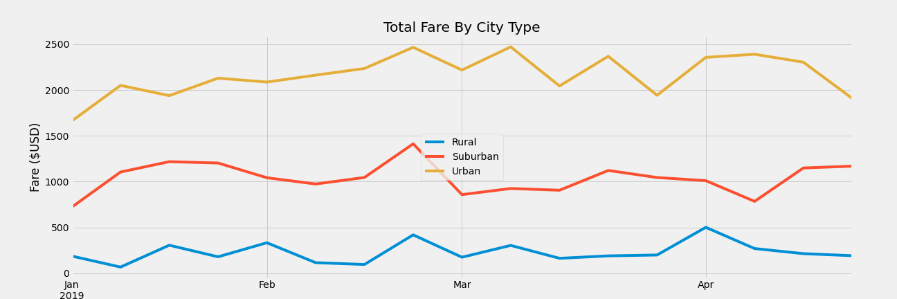

# pyber_analysis

## Overview of Project

The purpose of this project is to analyze ride-sharing data and provide recommendations to the client. Specifically, this project aims to create two reports to compare the performance by city types (urban, suburban and rural). The two reports are:

1. A ride-share summary DataFrame 
2. A total weekly fares DataFrame and multiple-line graph

## Results

The data preparation utilizes Python, Pandas and Matplotlib to create DataFrames and charts to explore the data. Insight are generated on the <a href="PyBer_Challenge.ipynb">PyBer analysis</a>. 

### Ride-Sharing Summary By City Type

After consolidating the ride-sharing data by city type, the results showcase that urban cities have the most rides, drivers and total fares, whereas rural cities have the least rides, drivers, and total fares.

However, when comparing the average fare per ride and average fare per driver, rural cities are the most expensive and urban cities are less expensive. 

This is the Ride-Sharing Summary by City Type DataFrame:

### Weekly Total Fares Summary By City Type

The week-over-week total fares by city type DataFrame and line chart shows us that between January 1 to April 28 2019 that urban cities have the most total fares, followed by suburban cities then rural cities.

The week-over-week changes vary between each city, where some weeks may be high for others and some weeks may be low for others. 

However, it is important to note that on the week of 2019-02-24 that all three city types had a huge spike. This week had the highest total fares for both urban and suburban cities. 

This is the Weekly Total Fares Summary by City Type DataFrame:

This is the Weekly Total Fares Summary by City Type multiple-line chart:

## Summary

After analyzing the ride-sharing summary and total weekly fares summary for each city type, the three business recommendations for addressing the disparities among the city types are: 

1. Rural cities have the most expensive average fare per ride which can discourage those in rural areas to use ride-sharing services. To encourage rural city citizen to use the ride-sharing service, I suggest offering various promotions. This can include first-time offers, referrals, and off-peak hour discounts. 

2. The week-over-week change for each city type can vary by over $1000. This is a huge opportunity for the company if they can ensure consistent riders and fares. Since a ride-sharing business is an open marketplace, it requires two stakeholders: drivers and riders. This first suggestion will target the drivers. In order to ensure more consistent week-over-week fares, drivers will need to be more readily available to provide these services. By creating benefits for drivers, this can encourage them to be more active. This can include, increasing wages, off-peak bonuses or other employee benefits like health and dental benefits. 

3. The second suggestion to address the week-over-week changes for each city type, this will require to encourage more consistent rides from the riders. To do so, I suggest implementing an incentive program. For example, where after every 10 rides, you get 1 ride at a dicount. This can encourage riders to use this more consistently as they will get their 11th ride at an even cheaper rate. 